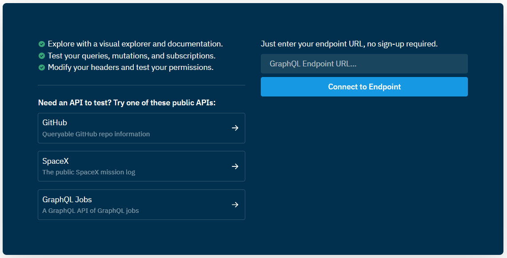

# Connexion à l'API via GraphiQL
## Connexion
Depuis votre navigateur, se rendre sur [ici](https://cloud.hasura.io/public/graphiql).

Dans le champ `GraphQL Endpoint URL`, renseigner le nom de votre API (ex: `https://VOTRE_INSTANCE.mc3i.io/api/v1/graphql`) puis cliquer sur `Connect to Endpoint`.

## Configuration des entêtes
Une fois connecté, renseigner l'entête `x-hasura-admin-secret` en utilisant la valeur transmise par M&C 3i.

Une fois renseigné, vous devriez voir apparaître le schéma complet de l'API dans l'explorer.