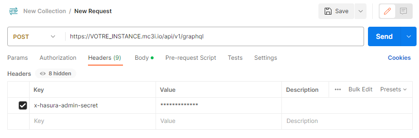
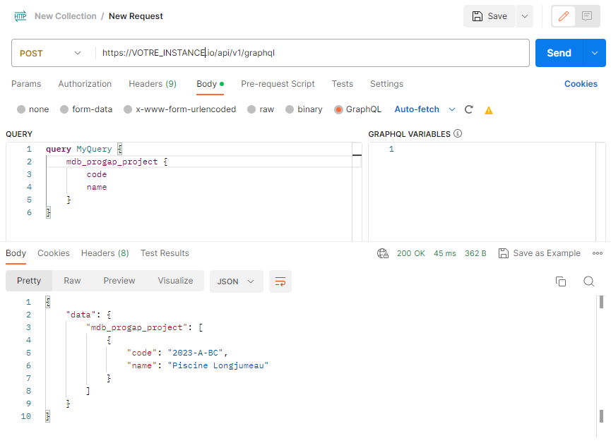

[API](..) / Connexion à l'API via Postman
## Connexion
Depuis l'application Postman, créer une nouvelle requête.

- Renseigner "POST dans la méthode 
- Renseigner le nom de votre API dans l'URL (ex: `https://VOTRE_INSTANCE.mc3i.io/api/v1/graphql`)
- Renseigner l'entête `x-hasura-admin-secret` en utilisant la valeur transmise par M&C 3i

## Effectuer une requête
Pour envoyer une requête, depuis l’onglet `Body`, sélectionner l’option GraphQL, renseigner une requête et les éventuelles variabes de la requête puis cliquer sur `Send`.

